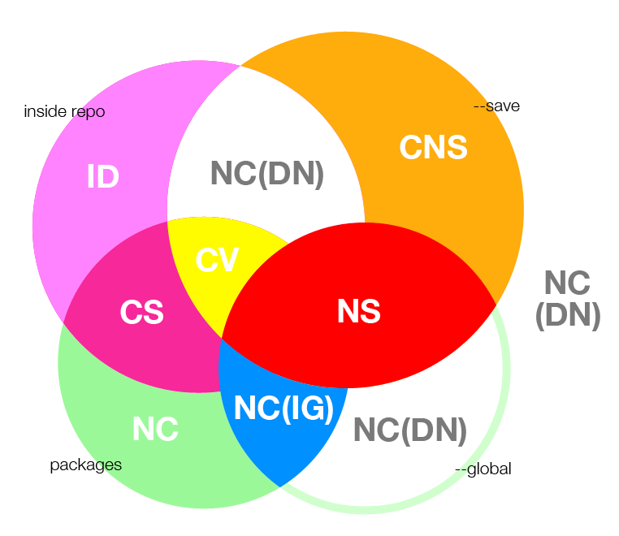

# Option configurations

> The developers' draft

The [comfort](https://github.com/kaelzhang/node-comfort) option configurations. 

### exports.options `Object`

An object composed of `<key>: <configuration>`

See npm module, `clean` for details.

## option/install

- **Errors**
  - NS: make No Sense
  - CNS: Can Not Save dependencies
- **Warnings**
  - DN: will Do Nothing
- **Additional**
  - CS: Check if install a package into itSelf
  - IG: Install Globally
  - CV: will Check duplicate Versions
  - ID: Install packages from Dependencies
  - NC: No Checking